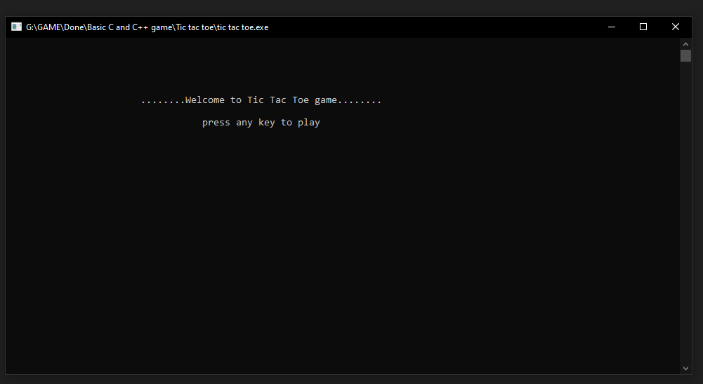
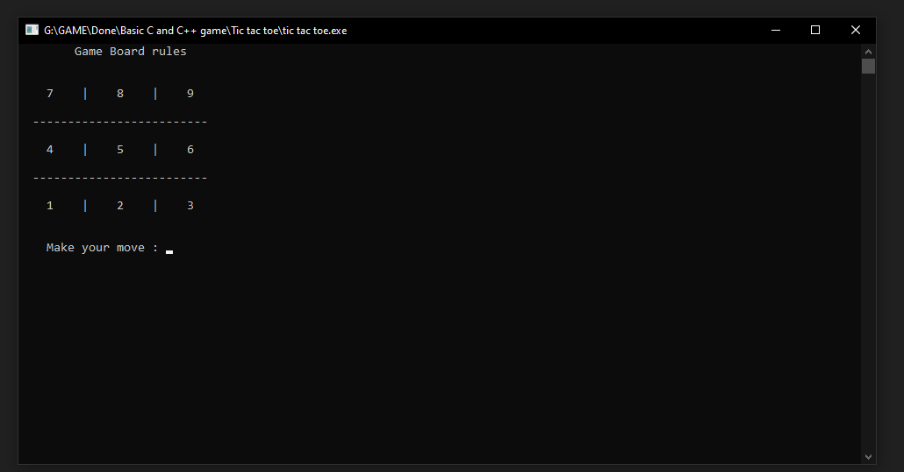
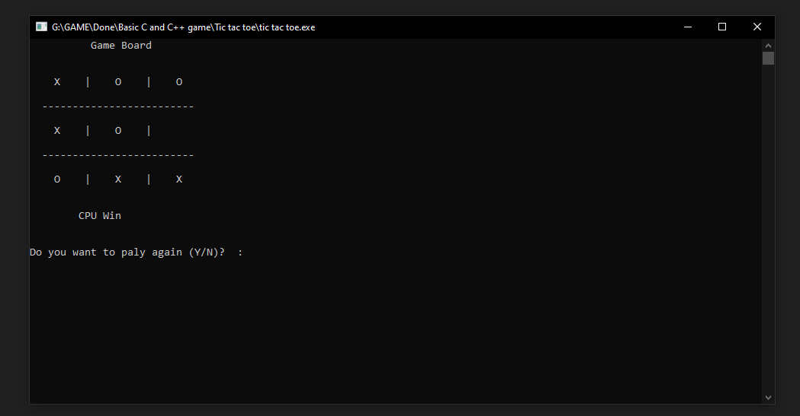
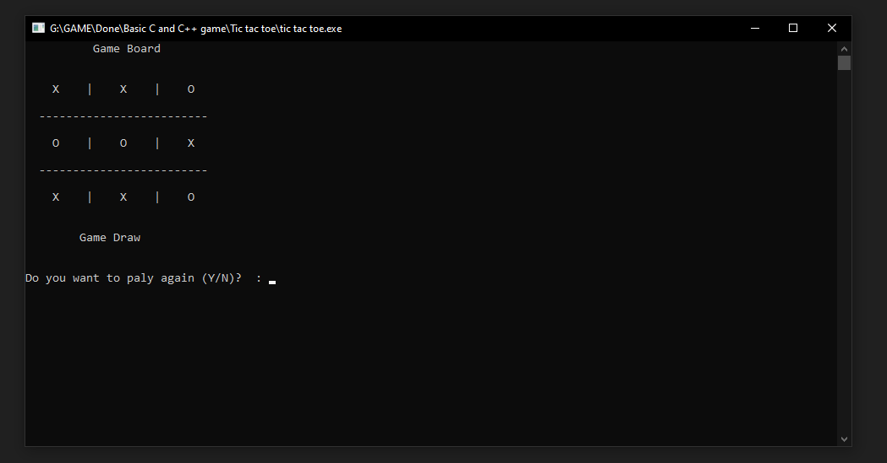

# TicTacToe
This game was made in 2017. I use C++ for it. I also use min-max algorithm for the bot system, and you cannot able to win with this. ;)

## Project description
Name: Tic Tac Toe  
Programming Language: C++  
Project No: 2  
Year: 2017

## Demo Video

<video width="400" controls>
  <source src="mov_bbb.mp4" type="demo/demo_video.mp4">
</video>

## Screen shot
### Homescreen
 

### Instruction Page
 

### Game Window
 

### GamePlay
 

## Authors

* **AbirHasan**

Check out my other works [@XAbirHasan](https://github.com/XAbirHasan)
